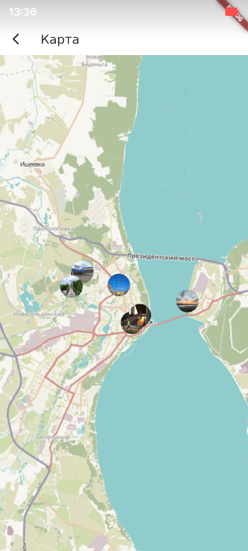

Главный экран

В правом верхнем углу можно нажать на кнопку и перебросит на страницу карты

При клике на метку на карте или на фотографию на главном экране происходит переход на страницу просмотра фотографии.

Если у фотографии нет метаданных о местоположении - это отображается внизу фотографии.

При переходе на просмотр фотографии с главного экрана можно переходить к следующей фотографии свайпом.

    
    

Если на фотографии с метаданными нажать на кнопку меню в правом верхнем углу, появится меню с кнопками "Карта" и "Удалить".

При нажатии на кнопку "Карта" приложение перейдёт на карту и установит метку по координатам этой фотографии.

При нажатии кнопки "Удалить" появляется диалоговое окно подтверждения удаления.
