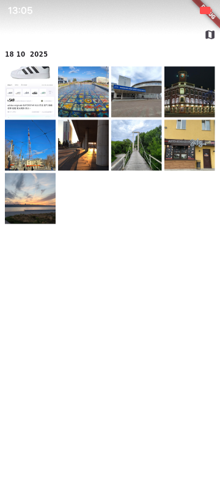

### Главный экран

### В правом верхенм углу можно нажать на кнопку и перебросит на страницу карты

### Также если кликнуть на метку на карте или на фототграфию на главном экране произойдёт переход на страницу прсмотра фотографии. Если у фотографии нет метаданных это отображается внизу фотографии. Также если произошёл переход на просмотр фотографии с главного экрана, то можно переходить к соедующей фотографии свайпом

    
    

